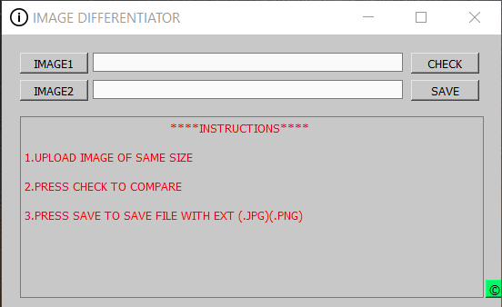

# Image Differentiator
The application is built with the help of python and pyqt.The application can be used to find the difference between two similar images.
UI layout is created by using Qt designer.

### 1.Loading images

### Original Image (Image1)

### Modified Image (Image2)

**Click *CHECK***

The differences are marked by red rectangles.

### Video
https://www.loom.com/share/e9d15a90bcca40588ebc4550cb3ff1a2

### Download

https://drive.google.com/open?id=1J66pnC3A0soLP-bD5yfhiDPgaGZLRIwP
